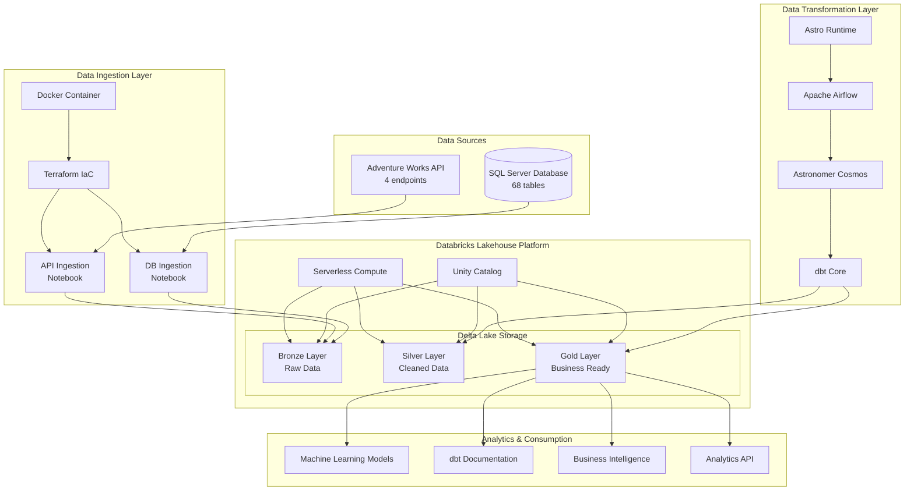
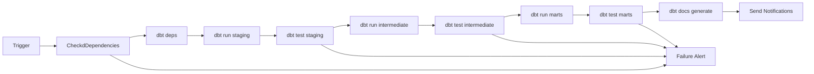

# Data pipeline

A comprehensive solution implementing modern data pipeline architecture, demonstrating best practices in data ingestion, transformation, and orchestration.

## Project Overview

This project implements a complete data pipeline covering the full data lifecycle from raw extraction to business-ready analytics.

**Key Components:**
- **Data ingestion** (`aw_ingestion-de`): Multi-source data extraction with Infrastructure as Code
- **Data transformation** (`aw_transform-ae`): dbt modeling with Airflow orchestration
- **Machine Learning** (`aw_ml-ds`): Predictive analytics and demand forecasting
- **Unified Storage**: Databricks Delta Lake with medallion architecture implementation


For detailed information on each pipeline component:

- **Data Ingestion**: For comprehensive setup, configuration, and deployment instructions → [README_ingestion.md](./aw_ingestion-de/README.md)
- **Data Transformation**: For dbt modeling, Airflow orchestration, and analytics documentation → [README_transform.md](./aw_transform-ae/README.md)
- **Machine Learning**: For predictive analytics, demand forecasting, and business intelligence → [README_ml.md](./aw_ml-ds/README.md)


## Architecture Overview

The pipeline implements a medallion architecture pattern with clear separation of concerns between ingestion and transformation layers:



## Project Structure

```
AW-LH-CHECKPOINT/
├── README.md                   
│
├── aw_ingestion-de/             # Data ingestion
│   ├── README.md                # Ingestion documentation
│   ├── deploy.sh                # Automated deployment script
│   ├── Dockerfile               # Terraform container
│   ├── docker-compose.yml       # Container orchestration
│   ├── .env                     # Ingestion environment variables
│   └── terraform/               # Infrastructure as Code
│       ├── main.tf              # Databricks resources
│       ├── variables.tf         # Variable definitions
│       └── notebooks/           # Data extraction logic
│           ├── api_ingestion.py      # API data extraction
│           └── db_ingestion.py       # Database extraction
│
├── aw_transform-ae/             # Data transformation
│   ├── README.md                # Transformation documentation
│   ├── airflow_settings.yaml    # Airflow configuration
│   ├── Dockerfile               # Astro Runtime container
│   ├── requirements.txt         # Python dependencies
│   ├── packages.txt             # System packages
│   ├── config/                  # Configuration files
│   ├── include/                 # Shared utilities
│   ├── plugins/                 # Custom Airflow plugins
│   └── dags/                    # Airflow DAGs
│       ├── aw_transforma_dag.py      # Main orchestration DAG
│       └── dbt/                 # dbt project
│           └── aw_transform/     # dbt transformations
│               ├── dbt_project.yml        # dbt configuration
│               ├── packages.yml           # dbt packages
│               ├── package-lock.yml       # Package versions
│               ├── profiles.yml           # Connection profiles
│               ├── models/               # Data models
│               │   ├── staging/          # Raw data staging
│               │   │   ├── api/          # API source models
│               │   │   │   ├── stg_api__sales_order_header.sql
│               │   │   │   ├── stg_api__sales_order_detail.sql
│               │   │   │   └── api.yml   # API source documentation
│               │   │   └── db/           # Database source models
│               │   │       ├── stg_db__sales_order_header.sql
│               │   │       ├── stg_db__customer.sql
│               │   │       ├── stg_db__product.sql
│               │   │       ├── stg_db__person.sql
│               │   │       └── db.yml    # Database source documentation
│               │   ├── intermediate/     # Data processing
│               │   │   ├── int_sales.sql
│               │   │   ├── int_payment_method.sql
│               │   │   ├── int_customer_segmentation.sql
│               │   │   └── intermediate.yml
│               │   ├── marts/            # Business layer
│               │   │   ├── fact_sales.sql
│               │   │   ├── fact_sales_monthly_agg.sql
│               │   │   ├── dim_customer.sql
│               │   │   ├── dim_product.sql
│               │   │   ├── dim_sales_person.sql
│               │   │   ├── dim_territory.sql
│               │   │   ├── dim_payment_method.sql
│               │   │   ├── dim_calendar.sql
│               │   │   ├── bridge_sales_reason.sql
│               │   │   └── marts.yml     # Marts documentation
│               │   └── analytics/        # Analytics ready
│               │       ├── dates.sql
│               │       └── analytics.yml
│               ├── macros/               # Reusable SQL functions
│               │   ├── generate_schema_name.sql
│               │   └── test_helpers.sql
│               └── tests/                # Data quality tests
│                   └── singular/         # Custom business tests
│                       ├── test_sales_order_totals_match.sql
│                       ├── test_customer_sales_consistency.sql
│                       ├── test_product_quantity_outliers.sql
│                       └── test_revenue_month_over_month.sql
│
└── aw_ml-ds/                    # Machine Learning & Analytics
    ├── README.md                # ML documentation
    ├── 1. Previsão de demanda.ipynb            # Product/store demand forecasting
    ├── 2. Viabilidade de modelos de regressao.ipynb       # Regression model evaluation
    ├── 3. Crescimento por centro de distribuicao.ipynb    # Regional growth analysis
    └── 4. Estimativa de zipers.ipynb           # Supply chain optimization

```

## Technology Stack

### Core Technologies
- **Python**: Primary programming language for data processing
- **Apache Airflow**: Workflow orchestration and scheduling
- **dbt Core**: Data transformation framework
- **Terraform**: Infrastructure as Code for cloud resources
- **Docker**: Containerization for consistent deployment

### Cloud Platform
- **Databricks**: Unified analytics platform
- **Delta Lake**: ACID-compliant data lakehouse storage
- **Unity Catalog**: Centralized data governance
- **Serverless Compute**: Auto-scaling compute resources

### Integration Tools
- **Astronomer Cosmos**: Airflow and dbt integration
- **Astro Runtime**: Production-ready Airflow environment
- **PySpark**: Distributed data processing
- **SQL Server JDBC**: Database connectivity

## Prerequisites

### System Requirements
- **Operating System**: Linux, macOS, or Windows with WSL2
- **Docker**: with Docker Compose
- **Python**
- **Git**: for version control

### Cloud Platform Access
- **Databricks Workspace**: Unity Catalog enabled
- **Databricks SQL Warehouse**: Serverless compute recommended
- **Personal Access Token**: For Databricks API authentication
- **Adventure Works Database**: SQL Server access credentials

### Development Tools
- **Astro CLI**: Latest version for Airflow development
- **VS Code**: With Python and SQL extensions


## Data Pipeline Architecture

### Ingestion Layer (Raw)

**Data Sources:**
- **Adventure Works API**: 4 REST endpoints
- **SQL Server Database**: 68 tables

**Extraction Process:**
- **Parallel Processing**: Concurrent extraction for optimal performance
- **Schema Detection**: Automatic schema inference for API data
- **Error Handling**: Comprehensive retry logic and error recovery
- **Idempotent Design**: Re-execution without data duplication

### Transformation Layer (Staging/Intermediate/Marts)

**dbt Model Architecture:**

**Staging Layer** (`models/staging/`):
- Raw data standardization and type casting
- Source-specific transformations and cleaning
- Consistent naming conventions across sources
- Basic data validation and filtering

**Intermediate Layer** (`models/intermediate/`):
- Business logic application and complex calculations
- Data integration from multiple sources

**Marts Layer** (`models/marts/`):
- Production-ready fact and dimension tables
- Optimized for analytical queries
- Comprehensive business rules implementation

### Data Models and Business Entities

**Fact Tables:**
- `fact_sales` - Detailed sales transactions with full grain
- `fact_sales_monthly_agg` - Monthly aggregated sales metrics 

**Bridge Tables:**
- `bridge_sales_reason` - Many-to-many relationship between sales and reasons

**Dimension Tables:**
- `dim_customer` - Customer data
- `dim_product` - Product catalog with hierarchy (category → subcategory → product)
- `dim_sales_person` - Sales representative information
- `dim_territory` - Geographic territories with hierarchy
- `dim_payment_method` - Credit card types
- `dim_calendar` - Date dimension

## Data quality and testing

### Testing

**Generic tests** (Applied across all models):
- `unique`: Primary key constraints
- `not_null`: Required field validation
- `relationships`: Foreign key integrity
- `accepted_values`: Enumerated value validation

**Singular Tests** (Business logic validation):
1. **Sales order totals match**: Validates header vs. detail calculations
2. **Customer sales consistency**: Ensures data consistency across sources
3. **Product quantity outliers**: Identifies unrealistic order quantities

**Data Quality Metrics:**
- Test coverage: 100% of fact and dimension tables
- Test execution: Automated with every pipeline run
- Failure handling: Pipeline stops on critical test failures
- Monitoring: Slack notifications for test results

## Orchestration and Scheduling

### Apache Airflow Implementation

**DAG Configuration:**
- **Schedule**: Daily execution at 6:00 AM

**Task Structure:**
1. **Dependency check**: Validate source data availability
2. **dbt deps**: Install required packages
3. **dbt run**: Execute models in dependency order
4. **dbt test**: Run data quality validations
5. **Documentation**: Generate fresh dbt docs
6. **Notifications**: Send success/failure alerts

### Execution Flow



## Machine Learning & Predictive Analytics

### ML Pipeline Overview

The machine learning component (`aw_ml-ds`) leverages the clean, business-ready data from the transformation layer to deliver actionable predictions and strategic insights.

**Core Capabilities:**
- **Demand Forecasting**: Product-store level predictions for inventory optimization
- **Regional Growth Analysis**: Strategic market expansion insights
- **Supply Chain Optimization**: Material requirement planning and procurement
- **Model Performance Validation**: Comprehensive evaluation and comparison frameworks

### Business Problems & Solutions

**1. Demand Forecasting** ([1. Previsão de demanda.ipynb](https://github.com/YasmimAbrahao/AW-LH-CHECKPOINT/blob/develop/aw_ml-ds/1.%20Previs%C3%A3o%20de%20demanda.ipynb))
- **Objective**: 3-month demand predictions at product-store granularity
- **Models**: ARIMA, Prophet, Moving Averages comparison
- **Output**: Actionable forecasts with confidence intervals
- **Key Insight**: Simple baselines often outperform complex models for volatile products

**2. Regression Model Evaluation** ([2. Viabilidade de modelos de regressao.ipynb](https://github.com/YasmimAbrahao/AW-LH-CHECKPOINT/blob/develop/aw_ml-ds/2.%20Viabilidade%20de%20modelos%20de%20regressao.ipynb))
- **Objective**: Scalable forecasting approach for entire product catalog
- **Models**: XGBoost, Random Forest, Linear Regression
- **Validation**: Time Series Cross-Validation (5 folds)
- **Result**: 54.6% improvement over baseline (XGBoost: 102.1% vs 225.2% MAPE)

**3. Regional Growth Analysis** ([3. Crescimento por centro de distribuicao.ipynb](https://github.com/YasmimAbrahao/AW-LH-CHECKPOINT/blob/develop/aw_ml-ds/3.%20Crescimento%20por%20centro%20de%20distribuicao.ipynb))
- **Objective**: Compare US provinces vs. international market growth
- **Approach**: Polynomial trend modeling with 12-month smoothing
- **Strategic Finding**: International markets (+30.0%) vs US decline (-4.8%)
- **Impact**: Clear direction for resource allocation and market investment

**4. Supply Chain Optimization** ([4. Estimativa de zipers.ipynb](https://github.com/YasmimAbrahao/AW-LH-CHECKPOINT/blob/develop/aw_ml-ds/4.%20Estimativa%20de%20zipers.ipynb))
- **Objective**: Zipper procurement planning for glove production
- **Business Rule**: 2 zippers per glove pair
- **Methodology**: Conservative 12-month moving average for volatility management
- **Recommendation**: 83,080 zippers for next 3 months

### Technical Implementation

**Model Validation Framework:**
- **Metrics**: MAE, RMSE, MAPE, R² for comprehensive evaluation
- **Cross-Validation**: Time Series Split to prevent data leakage
- **Performance Tracking**: Consistent model comparison across business problems

**Feature Engineering:**
- **Temporal Features**: Lag variables (1, 2, 3, 6, 12 months)
- **Trend Indicators**: Moving averages (3, 6, 12 months)
- **Seasonality**: Month, quarter, year indicators
- **Volatility Measures**: Rolling standard deviations

**Business Impact:**
- **Inventory Optimization**: Reduced stockouts and excess inventory
- **Strategic Planning**: Data-driven market investment decisions
- **Supply Chain Efficiency**: Precise material requirement planning
