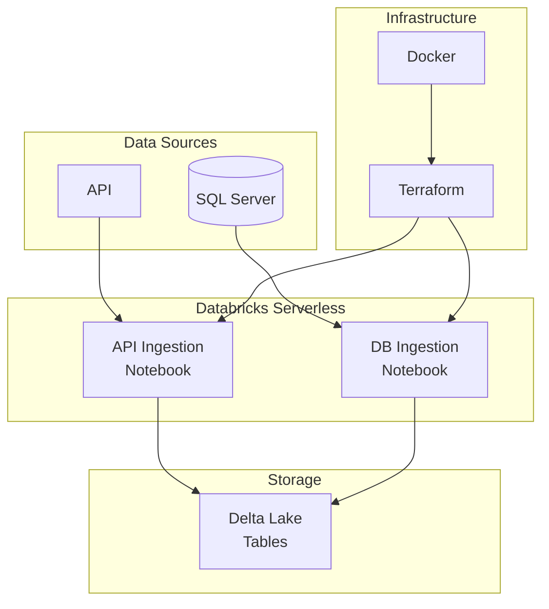
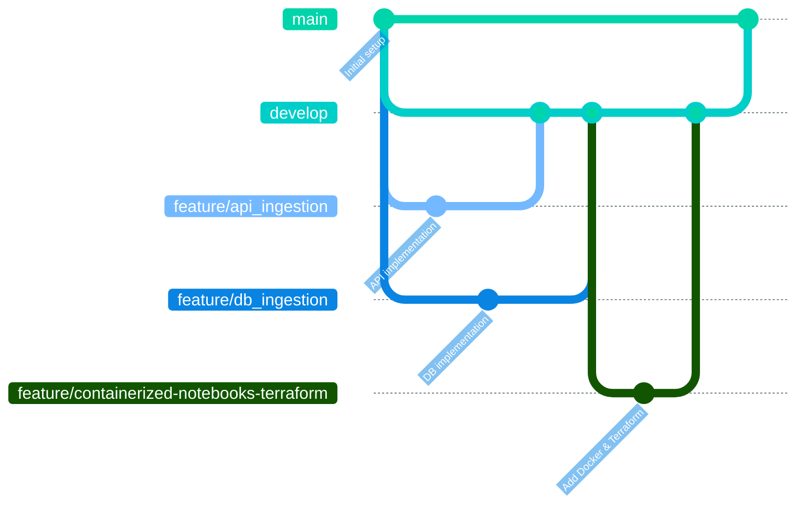

# Adventure Works data ingestion pipeline

A data ingestion pipeline that extracts data from multiple sources API and SQL Server database and loads it into Databricks Delta Lake tables.

## Project overview

This project implements a comprehensive data ingestion solution for Adventure Works, demonstrating best practices in:
- Multi-source data extraction API and SQL Server Database
- Databricks Serverless compute
- Infrastructure as Code using Terraform
- Containerization with Docker
- Parallel processing for optimal performance
- Error handling and idempotency for production reliability

## Architecture 



## Project structure

```
aw-lh-checkpoint/
├── README.md                    
├── deploy.sh                    # Automated deployment script
├── Dockerfile                   # Terraform container with dependencies
├── docker-compose.yml           # Container orchestration
├── .env                         # Environment variables 
├── .gitignore                   # Files git will ignore
└── terraform/                   
    ├── main.tf                  # Main Databricks resources
    ├── variables.tf             # Variable definitions
    └── notebooks/               # Processing logic
        ├── api_ingestion.py     # API data ingestion pipeline
        └── db_ingestion.py      # Database ingestion pipeline
```

## Getting started

### Prerequisites

- Docker and Docker Compose installed
- Access to Azure Databricks workspace
- Databricks personal access token

### Environment configuration

1. Clone the repository:
```bash
git clone <repository-url>
cd aw-lh-checkpoint
```

2. Create environment file:
```bash
cp .env.example .env
```

3. Configure `.env` file with your credentials:
```bash
# Databricks configuration
DATABRICKS_HOST=https://adb-xxxxxxxxx.x.azuredatabricks.net
DATABRICKS_TOKEN=dapi********************************

# API configuration  
API_URL=http://xxx.xxx.xxx.xxx:8080/
API_USER=xxxxxx
API_PASSWORD=********

# Database configuration
DB_URL=jdbc:sqlserver://xxx.xxx.xxx.xxx:4563;databaseName=xxxx;encrypt=false;trustServerCertificate=true
DB_USER=xxxxxx
DB_PASSWORD=********

# Output configuration
OUTPUT_PATH=/Workspace/Users/your.email@domain.com/WORKSPACE_NAME
PATH_TABLE_OUTPUT=catalog_name.schema_name
```

## Deployment

### Automated deployment 

```bash
# Grant execution permission
chmod +x deploy.sh

# Execute complete deployment
./deploy.sh
```

### Manual deployment

```bash
# Initialize Terraform
docker compose run --rm terraform init

# Validate configuration
docker compose run --rm terraform validate

# Apply infrastructure
docker compose run --rm terraform apply -auto-approve
```

## Git workflow

This project was developed following a Git Flow branching strategy with parallel feature development.

## Branching strategy
The development process utilized a structured approach with clearly defined branch purposes:

- main: production code with stable releases
- develop: integration branch for ongoing development
- feature/*: individual feature development in isolation
- Feature branches: feature/api_ingestion, feature/db_ingestion, feature/containerized-notebooks-terraform

### Development workflow

The project development followed this Git workflow:


### Hotfix 

While no hotfixes were needed during development, the workflow supports emergency fixes:
- Direct branches from `main` for critical production issues
- Fast-track merge process for urgent deployments
- Automatic back-merge to `develop` to maintain consistency