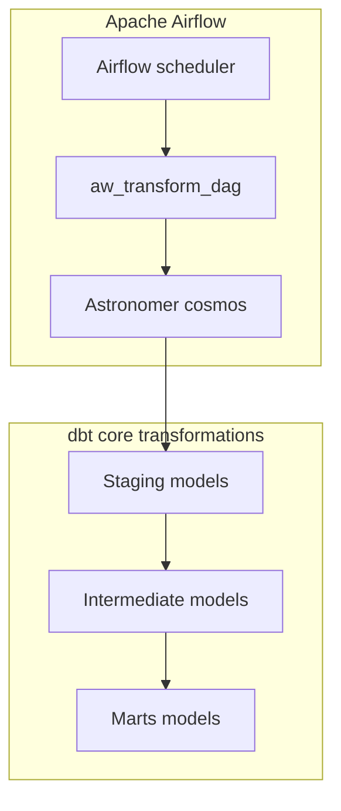
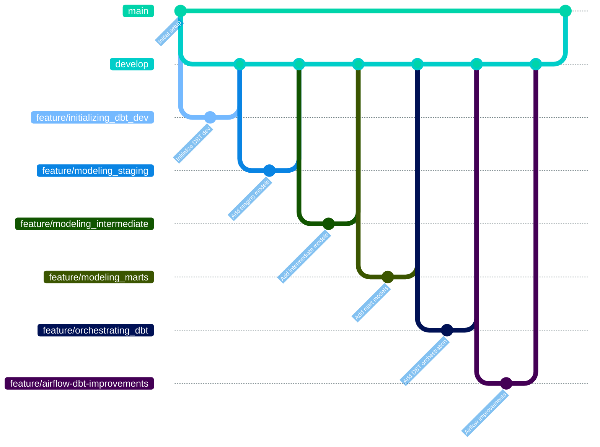

# Data transformation pipeline

A comprehensive data transformation solution using dbt for modeling and validation, Apache Airflow with Astronomer Cosmos for orchestration, and Databricks Delta Lake as the destination. This pipeline transforms raw data into analytics ready models.

## Project overview

This project implements a comprehensive data transformation solution for Adventure Works, demonstrating best practices in:
- Multi-layer data modeling with dbt (staging → intermediate → marts)
- Apache Airflow orchestration with Astronomer Cosmos
- Databricks Delta Lake as analytical storage
- Comprehensive data quality testing and validation
- Auto-generated documentation and lineage tracking
- Containerized deployment for consistency and portability

## Architecture


## Project structure

```
aw_transform-ae/
├── airflow_settings.yaml      # Airflow configuration
├── Dockerfile                 # Astro Runtime container
├── requirements.txt          # Python dependencies
├── README.md                 # This file
│
├── config/                   # Configuration files
├── include/                  # Shared utilities
├── plugins/                  # Custom Airflow plugins
│
└── dags/                     # Airflow DAGs
    ├── aw_transforma_dag.py  # Main orchestration DAG
    └── dbt/                  # dbt project
        └── aw_transform/     # dbt transformations
            ├── dbt_project.yml        # dbt configuration
            ├── packages.yml           # dbt packages
            ├── package-lock.yml       # Package versions
            │
            ├── models/               # Data models
            │   ├── staging/          # Raw data staging
            │   │   ├── api/          # API source models
            │   │   │   ├── stg_api__sales_order_header.sql
            │   │   │   ├── stg_api__sales_order_detail.sql
            │   │   │   └── api.yml   # API source documentation
            │   │   └── db/           # Database source models
            │   │       ├── stg_db__sales_order_header.sql
            │   │       ├── stg_db__customer.sql
            │   │       ├── stg_db__product.sql
            │   │       └── db.yml    # Database source documentation
            │   ├── intermediate/     # Data processing
            │   │   ├── int_sales.sql
            │   │   ├── int_payment_method.sql
            │   │   ├── int_customer_segmentation.sql
            │   │   └── intermediate.yml
            │   ├── marts/            # Business layer
            │   │   ├── fact_sales.sql
            │   │   ├── fact_sales_monthly_agg.sql  # Additional fact table
            │   │   ├── dim_customer.sql
            │   │   ├── dim_product.sql
            │   │   ├── dim_territory.sql
            │   │   ├── dim_payment_method.sql
            │   │   ├── dim_calendar.sql
            │   │   ├── bridge_sales_reason.sql
            │   │   └── marts.yml     # Marts documentation
            │   └── analytics/        # Analytics ready
            │       └── dates.sql
            │
            └── tests/                # Data quality tests
               └── singular/         # Custom business logic tests
                   ├── test_sales_order_totals_match.sql
                   ├── test_customer_sales_consistency.sql
                   └── test_product_quantity_outliers.sql
```

## Getting started

### Prerequisites

- **Docker and Docker Compose** ([Installation guide](https://docs.docker.com/engine/install/))
- **Git** ([Git download](https://git-scm.com/downloads))
- **Access to Azure Databricks workspace**
- **Databricks personal access token** ([How to create personal access token](https://docs.databricks.com/aws/en/dev-tools/auth/pat))
- **Astro CLI** ([Installation guide](https://www.astronomer.io/docs/astro/cli/install-cli/))
- **Databricks Workspace With Unity Catalog enabled**

## Dependencies

### Python Packages
```txt
# Core orchestration
astronomer-cosmos

# dbt integration
dbt-databricks
dbt-core
```

### dbt Packages
```yml
# packages.yml
packages:
  - package: dbt-labs/dbt_utils
    version: 1.3.0
```


### Environment Setup

1. **Clone the repository**
   ```bash
   git clone <repository-url>
   cd aw_transform-ae
   ```

2. **Configure environment variables**
   ```bash
   cp .env.example .env
   nano .env
   ```

3. **Required Environment Variables**
   ```bash
   # Databricks Configuration
   AIRFLOW_VAR_DBT_PROFILE_NAME=databricks
   AIRFLOW_VAR_DBT_TARGET_NAME=dev
   AIRFLOW_VAR_DATABRICKS_CONNECTION_ID=databricks_default
   AIRFLOW_VAR_DATABRICKS_CATALOG=your_catalog_name
   AIRFLOW_VAR_DATABRICKS_SCHEMA=your_schema_name
   AIRFLOW_VAR_DATABRICKS_HOST=your_workspace.cloud.databricks.com
   AIRFLOW_VAR_DATABRICKS_HTTP_PATH=/sql/1.0/warehouses/your_warehouse_id
   AIRFLOW_VAR_DATABRICKS_TOKEN=dapixxxxxxxxxxxxxxxxxxxxxxx
   ```

### Deployment Options

#### Option 1: Astro CLI (Recommended)
```bash
# Initialize and start
astro dev init
astro dev start

# Access Airflow UI at http://localhost:8080
# Credentials: admin/admin
```

#### Option 2: Docker Compose
```bash
# Build and run
docker build -t aw-transform .
docker run -d -p 8080:8080 \
  --env-file .env \
  --name aw-transform \
  aw-transform
```

## Data Model Architecture

### Layer Structure

Our dbt models follow a three-layer architecture aligned with Analytics Engineering best practices:

#### **Staging Layer** (`models/staging/`)
- **Purpose**: Standardize and clean raw data
- **Naming**: `stg_<source>__<table_name>`
- **Operations**: Type casting, column renaming, basic filtering
- **Materialization**: Ephemeral

**Example models:**
- `stg_db__sales_order_header.sql` - Database sales order header
- `stg_api__sales_order_detail.sql` - API sales order details
- `stg_db__customer.sql` - Customer data
- `stg_db__product.sql` - Product catalog

#### **Intermediate Layer** (`models/intermediate/`)
- **Purpose**: Business logic and data joins
- **Naming**: `int_<business_concept>`
- **Operations**: Complex transformations, aggregations, business rules
- **Materialization**: Ephemeral

**Example models:**
- `int_sales.sql` - Combined sales data from API and DB sources
- `int_payment_method.sql` - Payment method standardization

#### **Marts Layer** (`models/marts/`)
- **Purpose**: Business-ready dimensional models
- **Naming**: `dim_<entity>` for dimensions, `fact_<event>` for facts
- **Operations**: Final business logic, optimized for analytics
- **Materialization**: Tables

### Business Entities

Our dimensional model includes:

**Fact Tables:**
- `fact_sales` - Detailed sales transactions with full grain
- `fact_sales_monthly_agg` - Monthly aggregated sales metrics 

**Bridge Tables:**
- `bridge_sales_reason` - Many-to-many relationship between sales and reasons

**Dimension Tables:**
- `dim_customer` - Customer data
- `dim_product` - Product catalog with hierarchy (category → subcategory → product)
- `dim_sales_person` - Sales representative information
- `dim_territory` - Geographic territories with hierarchy
- `dim_payment_method` - Credit card types
- `dim_calendar` - Date dimension

## Data quality and testing

### Generic tests
Applied across all models for basic data integrity:

```yaml
# models/staging/db/db.yml
version: 2

models:
  - name: stg_db__sales_order_header
    columns:
      - name: sales_order_id
        tests:
          - not_null
          - unique
      - name: customer_id
        tests:
          - not_null
          - relationships:
              to: ref('stg_db__customer')
              field: customer_id

# models/marts/marts.yml
version: 2

models:
  - name: fact_sales
    columns:
      - name: sales_order_detail_id
        tests:
          - not_null
          - unique
      - name: order_quantity
        tests:
          - dbt_utils.accepted_range:
              min_value: 1
              max_value: 1000
```

### Singular Tests
Custom business logic validation with 4 comprehensive tests:

#### 1. Sales Order Totals Match (`test_sales_order_totals_match.sql`)
Validates that order header totals match sum of line items:
```sql
/* Ensures data consistency between header and detail tables
  Checks for calculation errors in line_total vs (unit_price * quantity)
  Identifies potential data integration issues */
```

#### 2. Customer Sales Consistency (`test_customer_sales_consistency.sql`)
Ensures customer data consistency across API and DB sources:
```sql
/* Validates customer information matches between sources
   Checks for orphaned sales records
   Ensures referential integrity */
```

#### 3. Product Quantity Outliers (`test_product_quantity_outliers.sql`)
Identifies unrealistic product quantities:
```sql
/* Flags orders with quantities > 3 standard deviations from mean
   Helps identify data entry errors
   Validates business rule compliance */
```

### Test Execution
```bash
# Run all tests
dbt test

# Run specific test types
dbt test --select test_type:generic
dbt test --select test_type:singular

# Run tests for specific models
dbt test --select fact_sales

# Store test failures for analysis
dbt test --store-failures

# Run tests with detailed output
dbt test --debug
```

## Pipeline Orchestration

### DAG Configuration

Our main DAG (`aw_transforma_dag.py`) implements:

- **Daily Schedule**: `0 6 * * *` (6 AM daily)
- **Idempotent Design**: Safe re-execution without data duplication
- **Error Handling**: Automatic retries with exponential backoff
- **Monitoring**: Built-in alerting and logging

### Execution Flow

1. **Dependencies check**: Validate data source availability
2. **dbt deps**: Install package dependencies
3. **dbt run**: Execute all models in dependency order
   - Staging models
   - Intermediate models
   - Marts models (tables)
4. **dbt test**: Run data quality tests
5. **Documentation**: Generate dbt docs
6. **Notifications**: Send success/failure alerts

## Documentation & Lineage
### Accessing dbt Documentation
The dbt documentation provides comprehensive insights into your data models, lineage, and business logic. There are multiple ways to access it:

### Option 1: Static HTML file
The documentation is pre-generated and available as a static file in the repository named as `dbt_docs.html`.

### Option 2: Via Airflow UI

When running the full pipeline:
```
Navigate to http://localhost:8080
Go to Browse → DAGs
Find the aw_transform_dag
Access Graph View to see dbt model dependencies
Check Task Instance Details for documentation links
```

### Documentation Features
- **Model Lineage**: Visual data flow representation showing dependencies
- **Column Documentation**: Detailed field descriptions with business context
- **Test Results**: Data quality validation outcomes with failure details
- **Business Glossary**: Standardized metric definitions and calculations
- **Source Data**: Information about raw data sources and freshness

## Git workflow

This project was developed following a Git Flow branching strategy with structured feature development.

### Branching strategy
The development process utilized a structured approach with clearly defined branch purposes:

- **main**: production code with stable releases
- **develop**: integration branch for ongoing development
- **feature/***: individual feature development in isolation

### Development workflow

The project development followed this Git workflow:

